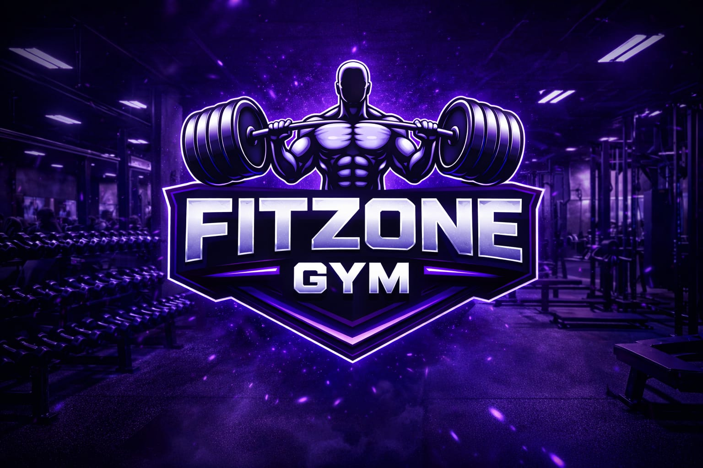

# 🏋️ FitZone Gym — Full-Stack Gym Management Web Application

<p align="center">
  
</p>

<p align="center">
  
  
  
  
  
</p>

---

## 🚀 Overview

**FitZone Gym** is a fully functional, full-stack gym management web application built with **Python (Flask)** and **MySQL**. It serves as a complete digital platform for a modern fitness center — from showcasing gym programs and membership plans to managing member registrations, logins, and AI-powered fitness tools.

### The Problem It Solves

Traditional gyms rely on paper forms, phone calls, and manual spreadsheets to manage memberships, track members, and offer fitness guidance. FitZone Gym eliminates this friction by providing:

- A **self-service portal** where members register, log in, and manage their fitness journey online.
- **Built-in fitness intelligence** — BMI calculator, TDEE-based calorie planner, macro diet planner, and a rule-based AI workout generator — all in one place.
- A **professional web presence** for the gym with program listings, membership plans, gallery, and multi-branch contact details.

### Who Is It For?

- **Gym owners** who want a modern, deployable website with member management.
- **Gym members** who want personalized fitness tools available 24/7.
- **Developers & students** learning full-stack web development with Flask, MySQL, and session management.

---

## ✨ Features

### 🌐 Public-Facing Pages
- **Home** — Welcome page highlighting gym USPs, focus areas, and calls to action.
- **About** — Gym philosophy, core values, and brand story.
- **Programs** — 7 specialized fitness programs (Weight Training, Cardio, Yoga, Personal Training, Muscle Gain, Fat Loss, Endurance) with direct registration links.
- **Membership Plans** — Monthly (₹1,500), Quarterly (₹4,000), and Yearly (₹14,000) plan cards.
- **Gallery** — Photo gallery with gym areas (main floor, dumbbell section, cardio zone, CrossFit, swimming pool, reception) and equipment (bench press, squat rack, lat pulldown, leg press, cable station).
- **Contact** — Multi-branch contact cards (Mumbai, Pune, Nashik) with Google Maps links and a contact form that saves messages to the database.

### 🔐 Member Authentication
- **Registration** — Comprehensive onboarding form capturing personal details (name, email, mobile, DOB, gender), fitness info (height, weight, goal), chosen membership plan, medical information, and emergency contact.
- **Login** — Session-based login with email and password verification.
- **Logout** — Secure session termination.
- **Protected Routes** — Dashboard and all AI tools require authentication; unauthenticated users are redirected to login.

### 🤖 AI-Powered Fitness Tools (Dashboard)
All tools are locked behind authentication and accessible from the member dashboard:

- **BMI Calculator** — Calculates Body Mass Index from height (cm) and weight (kg).
- **Smart Calorie Calculator** — Uses the **Mifflin-St Jeor BMR formula** with TDEE activity multipliers, then adjusts calories for goal (−500 kcal for Weight Loss, +400 kcal for Muscle Gain).
- **AI Diet Planner** — Generates a macro breakdown (protein, carbohydrates, fats in grams) based on total daily calories and goal, using scientifically structured macro ratios per goal type, plus a suggested meal structure.
- **AI Workout Planner** — Rule-based intelligent workout generator that produces a day-by-day weekly split based on fitness goal (Muscle Gain / Weight Loss / Strength), days per week (2–6+), and experience level (Beginner / Intermediate / Advanced). The system adapts volume notes per level.

### 🎨 UI & Design
- Dark gym-themed aesthetic with a full-screen gym background image and a black-purple gradient overlay.
- Purple neon accent colors (`#d580ff`) with CSS text-shadow glow effects.
- Responsive card-based layouts for plans, programs, gallery, and dashboard tools.
- Consistent `base.html` layout template with dynamic navigation (shows Dashboard/Logout vs. Register/Login based on session state).

---
## 🌐 Live Demo

🔗 [Click here to view the live project](https://drive.google.com/file/d/1faPxSk5k_VZTYIrKCzrjO-gwTdi4bUmq/view?usp=drive_link)

---

## 🛠️ Tech Stack

| Layer | Technology |
|---|---|
| **Backend** | Python 3.10+, Flask 3.1.2 |
| **Database** | MySQL 8 via `mysql-connector-python` |
| **ORM / DB Extras** | SQLAlchemy 2.0 (available), PyMySQL |
| **Templating** | Jinja2 (via Flask) |
| **Frontend** | HTML5, CSS3 (custom, 1000+ lines), no frontend framework |
| **Session Management** | Flask server-side sessions |
| **Production Server** | Gunicorn 25.3.0 |
| **Deployment Config** | `Procfile` (Heroku / Render compatible) |
| **Other Libraries** | `google-genai`, `openai`, `elevenlabs`, `scikit-learn`, `pandas`, `numpy` (available for future AI integration) |

---

## 🏗️ Architecture / How It Works

FitZone Gym follows the classic **MVC-style monolithic Flask architecture**:

```
Browser (HTML/CSS)
       ↓  HTTP Request
Flask Router (app.py)
       ↓  Route Handler
Business Logic (Python functions in app.py)
       ↓  SQL Query
MySQL Database (gym_db)
       ↑  Query Result
Jinja2 Template Engine
       ↑  Rendered HTML
Browser (HTML/CSS)
```

### Key Workflows

**1. Member Registration Flow**
```
GET /register → register.html form
POST /register → Extract 13 form fields → INSERT INTO members → Redirect to /login
```

**2. Login & Session Flow**
```
POST /login → SELECT * FROM members WHERE email & password match
           → If match: session["user"] = fullname → Redirect to /dashboard
           → If no match: Return error string
```

**3. AI Calorie Calculation Flow**
```
POST /calorie → Extract weight, height, age, gender, activity, goal
             → BMR = Mifflin-St Jeor formula (gender-specific)
             → TDEE = BMR × activity_multiplier
             → Adjust TDEE by goal → Return kcal result
```

**4. AI Workout Generation Flow**
```
POST /ai-workout → goal, days, level
               → generate_workout(goal, days, level)
               → Select split (PPL / Bro Split / Full Body / etc.)
               → Map split days to exercise prescriptions
               → Append volume note based on experience level
               → Return day-keyed dict → Render in template
```

**5. Contact Form Flow**
```
POST /contact → INSERT INTO contact (name, email, phone, message) → Return success
```

---

## 📂 Folder Structure

```
Fitzone-main/
│
├── app.py                   # Core Flask application — all routes & business logic
├── requirements.txt         # Python dependencies (pip freeze)
├── Procfile                 # Gunicorn deployment command (web: gunicorn app:app)
│
├── base.html                # Base Jinja2 layout template (header, nav, footer)
├── home.html                # Home / landing page
├── about.html               # About the gym
├── plans.html               # Membership plans (Monthly / Quarterly / Yearly)
├── programs.html            # Fitness programs listing (7 programs)
├── gallery.html             # Photo gallery (areas + equipment)
├── contact.html             # Contact cards + message form
│
├── login.html               # Member login form
├── register.html            # Full membership registration form
├── dashboard.html           # Protected member dashboard (links to tools)
│
├── bmi.html                 # BMI Calculator tool
├── calorie.html             # Smart Calorie Calculator tool
├── diet.html                # AI Diet Planner tool
├── ai_workout.html          # AI Workout Generator tool
│
├── style.css                # Global stylesheet (~1040 lines, gym dark theme)
│
└── *.jpg / *.jpeg / *.webp  # Gym images (background, gallery photos, equipment)
    ├── gym_bg.jpg           # Full-page background image
    ├── gym_area.jpg         # Main floor
    ├── dumbbell_section.jpg
    ├── cardio_section.jpg
    ├── crossfit_section.jpg
    ├── swimming_pool.jpg / .webp
    ├── reception.jpg
    ├── bench_press.jpg
    ├── squat_rack.jpg / .webp
    ├── lat_pulldown.jpg / .jpeg
    ├── leg_press.jpg / .webp
    └── cable_station.jpg / .jpeg
```

> **Note:** Flask expects templates in a `templates/` folder and static assets in `static/`. In production, the `.html` files should be moved to `templates/` and images/CSS to `static/images/` and `static/` respectively. The gallery references paths like `/static/images/gym_area.jpg`, confirming this intended structure.

---

## ⚙️ Installation & Setup

### Prerequisites

- Python 3.10+
- MySQL 8.0+
- pip

### 1. Clone the Repository

```bash
git clone https://github.com/your-username/fitzone-gym.git
cd fitzone-gym
```

### 2. Create a Virtual Environment

```bash
python -m venv venv
source venv/bin/activate        # macOS/Linux
venv\Scripts\activate           # Windows
```

### 3. Install Dependencies

```bash
pip install -r requirements.txt
```

### 4. Set Up the MySQL Database

Log into MySQL and run the following:

```sql
CREATE DATABASE gym_db;
USE gym_db;

CREATE TABLE members (
    id INT AUTO_INCREMENT PRIMARY KEY,
    fullname VARCHAR(100),
    email VARCHAR(100) UNIQUE,
    mobile VARCHAR(15),
    password VARCHAR(255),
    dob DATE,
    gender VARCHAR(10),
    height FLOAT,
    weight FLOAT,
    goal VARCHAR(50),
    plan VARCHAR(50),
    medical_info TEXT,
    emergency_name VARCHAR(100),
    emergency_number VARCHAR(15)
);

CREATE TABLE contact (
    id INT AUTO_INCREMENT PRIMARY KEY,
    name VARCHAR(100),
    email VARCHAR(100),
    phone VARCHAR(15),
    message TEXT
);
```

### 5. Configure Environment Variables

Create a `.env` file in the project root (see [Environment Variables](#-environment-variables) below):

```bash
cp .env.example .env
# Then edit .env with your actual values
```

### 6. Organize Project Structure

Move templates and static files into Flask's expected directories:

```bash
mkdir -p templates static/images
mv *.html templates/
mv style.css static/
mv *.jpg *.jpeg *.webp static/images/
```

### 7. Run the Application

**Development:**
```bash
python app.py
```

**Production (Gunicorn):**
```bash
gunicorn app:app
```

The app will be available at `http://127.0.0.1:5000`.

---

## 🔑 Environment Variables

Create a `.env.example` file with the following:

```env
# ─── Flask ───────────────────────────────────────
SECRET_KEY=your_flask_secret_key_here

# ─── MySQL Database ──────────────────────────────
DB_HOST=localhost
DB_USER=root
DB_PASSWORD=your_mysql_password
DB_NAME=gym_db

# ─── Optional: AI API Keys (for future integrations) ──
OPENAI_API_KEY=your_openai_api_key
GOOGLE_GENAI_API_KEY=your_google_genai_api_key
ELEVENLABS_API_KEY=your_elevenlabs_api_key
```

| Variable | Description |
|---|---|
| `SECRET_KEY` | Flask session signing key — use a long, random string in production |
| `DB_HOST` | MySQL server hostname (usually `localhost`) |
| `DB_USER` | MySQL username |
| `DB_PASSWORD` | MySQL password for the given user |
| `DB_NAME` | Name of the MySQL database (default: `gym_db`) |
| `OPENAI_API_KEY` | Optional — for future GPT-powered workout/diet features |
| `GOOGLE_GENAI_API_KEY` | Optional — for future Gemini AI integrations |
| `ELEVENLABS_API_KEY` | Optional — for future voice/audio features |

> ⚠️ **Security Note:** The current codebase hardcodes the secret key and DB credentials directly in `app.py`. Before deploying, move these to environment variables using `python-dotenv` or your hosting platform's environment config.

---

## 🧪 Usage

### Visitor Workflow
1. Visit the homepage → Browse programs and plans.
2. Click **Register** → Fill out the full membership form (personal + fitness + plan + emergency details).
3. After registration, log in with your email and password.

### Member Workflow
1. **Login** → Redirected to personal **Dashboard**.
2. Use the **BMI Calculator** → Enter height and weight → Get your BMI score.
3. Use the **Calorie Calculator** → Enter age, weight, height, gender, activity level, and goal → Get your recommended daily calories.
4. Use the **Diet Planner** → Enter calories and goal → Get your protein/carbs/fats macro breakdown + suggested meal structure.
5. Use the **AI Workout Planner** → Select goal, days per week, and experience level → Get a full weekly workout split with exercise prescriptions.
6. **Logout** when done.

### Example: Generating a Workout Plan

- **Goal:** Muscle Gain
- **Days per week:** 6
- **Level:** Intermediate

**Result (generated by the app):**
```
Day 1 → Push: Flat Bench Press 3x10, Incline Bench Press 3x10, ... | Progressive overload recommended.
Day 2 → Pull: Pull-ups 2x8, Barbell Rows 3x10, ... | Progressive overload recommended.
Day 3 → Legs: Squats 4x8, Leg Press 3x12, ... | Progressive overload recommended.
Day 4 → Push (repeat)
Day 5 → Pull (repeat)
Day 6 → Legs (repeat)
```

---

## 📸 Screenshots / Demo

> 📷 Add screenshots to a `/screenshots` folder and embed them here.

Suggested screenshots to capture:

| Page | File |
|---|---|
| Homepage | `screenshots/home.png` |
| Membership Plans | `screenshots/plans.png` |
| Fitness Programs | `screenshots/programs.png` |
| Member Dashboard | `screenshots/dashboard.png` |
| AI Workout Output | `screenshots/ai_workout.png` |
| Diet Plan Output | `screenshots/diet_plan.png` |
| Gallery | `screenshots/gallery.png` |

```markdown
<!-- Embed example (add after capturing) -->


```

---

## 🚧 Challenges & Learnings

### Challenges

**1. Session-Based Authentication Without an ORM**
Implementing protected routes with Flask's `session` object while using raw MySQL queries (no SQLAlchemy models) required careful management of the `cursor` lifecycle — particularly ensuring the DB cursor and connection remained valid across requests, a non-trivial problem with a persistent top-level connection object.

**2. Designing a Rule-Based Workout Generator**
Creating the `generate_workout()` function required mapping multiple input combinations (goal × days × level) to meaningful, realistic training splits. Balancing generalization (handling any `days` value) with specificity (PPL, Bro Split, Full Body) demanded careful conditional logic and fitness domain knowledge.

**3. Macro Calculation Without External APIs**
Building the diet planner to calculate protein/carbs/fats in grams from raw calorie targets — applying correct macronutrient calorie densities (4 kcal/g protein, 4 kcal/g carbs, 9 kcal/g fat) — required translating nutritional science directly into Python arithmetic.

**4. CSS Theming at Scale**
Writing over 1,000 lines of vanilla CSS for a dark, gym-aesthetic UI — with consistent card components, neon purple accents, glowing text shadows, a semi-transparent overlay on a full-screen background, and responsive layouts — without a framework was a significant frontend engineering challenge.

**5. Multi-Branch Contact Architecture**
Displaying contact information for multiple gym branches (Mumbai, Pune, Nashik) with embedded Google Maps links in a clean, card-based layout required thoughtful HTML/CSS component design.

### Learnings

- Practical application of Flask's **Jinja2 template inheritance** with `` and `` for DRY layouts.
- Deep understanding of the **Mifflin-St Jeor equation** and TDEE multipliers for fitness calculations.
- Importance of **input validation and error handling** at the route level (especially for `float()` conversions in calculator routes).
- Deploying Flask apps with **Gunicorn** via a `Procfile` for cloud platforms like Heroku/Render.
- Structuring **MySQL schemas** to hold complex member onboarding data with appropriate field types.

---

## 🔮 Future Improvements

- **🔒 Password Hashing** — Implement `bcrypt` or `werkzeug.security.generate_password_hash` for secure password storage (currently stored in plain text).
- **🌐 Environment Variable Management** — Migrate all secrets to `.env` using `python-dotenv`.
- **📊 Member Progress Tracking** — Add database tables and charts to track BMI, weight, and calorie history over time.
- **🤖 LLM-Powered Workout & Diet Plans** — Integrate the already-installed `google-genai` or `openai` libraries to replace rule-based generation with dynamic, conversational AI planning.
- **📧 Email Notifications** — Send confirmation emails on registration and contact form submission using `Flask-Mail`.
- **🛡️ CSRF Protection** — Add `Flask-WTF` CSRF tokens to all forms.
- **📱 Responsive Mobile Design** — Enhance CSS with media queries for mobile-first layouts.
- **🔄 Admin Dashboard** — Build an admin panel to view registrations, contact messages, and membership stats.
- **💳 Payment Integration** — Integrate Razorpay or Stripe for online membership fee collection.
- **🖼️ Image Optimization** — Serve `.webp` images by default (already in assets) and add lazy loading.

---

## 🤝 Contributing

Contributions are welcome! Here's how to get started:

```bash
# 1. Fork the repository
# 2. Create a feature branch
git checkout -b feature/your-feature-name

# 3. Make your changes and commit
git commit -m "feat: add your feature description"

# 4. Push to your fork
git push origin feature/your-feature-name

# 5. Open a Pull Request
```

### Guidelines
- Follow PEP 8 for Python code style.
- Keep route handlers focused — extract complex logic into helper functions.
- Add comments for any non-obvious business logic (especially fitness formulas).
- Test your changes locally with both a fresh registration and existing login before submitting.

---

## 📜 License

This project is licensed under the **MIT License**.

```
MIT License

Copyright (c) 2025 FitZone Gym

Permission is hereby granted, free of charge, to any person obtaining a copy
of this software and associated documentation files (the "Software"), to deal
in the Software without restriction, including without limitation the rights
to use, copy, modify, merge, publish, distribute, sublicense, and/or sell
copies of the Software, and to permit persons to whom the Software is
furnished to do so, subject to the following conditions:

The above copyright notice and this permission notice shall be included in all
copies or substantial portions of the Software.

THE SOFTWARE IS PROVIDED "AS IS", WITHOUT WARRANTY OF ANY KIND, EXPRESS OR
IMPLIED, INCLUDING BUT NOT LIMITED TO THE WARRANTIES OF MERCHANTABILITY,
FITNESS FOR A PARTICULAR PURPOSE AND NONINFRINGEMENT. IN NO EVENT SHALL THE
AUTHORS OR COPYRIGHT HOLDERS BE LIABLE FOR ANY CLAIM, DAMAGES OR OTHER
LIABILITY, WHETHER IN AN ACTION OF CONTRACT, TORT OR OTHERWISE, ARISING FROM,
OUT OF OR IN CONNECTION WITH THE SOFTWARE OR THE USE OR OTHER DEALINGS IN THE
SOFTWARE.
```

---

<p align="center">
  Built with 💪 by the FitZone Team &nbsp;|&nbsp; Powered by Flask & MySQL
</p>
